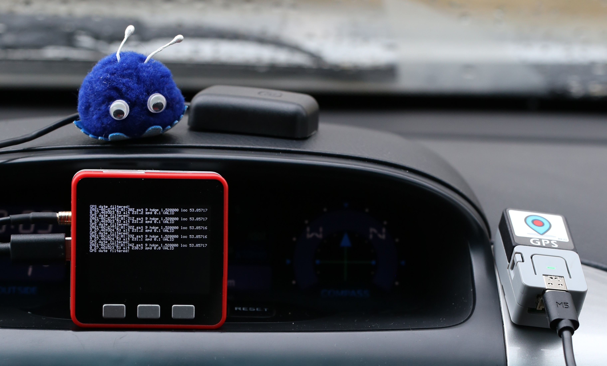
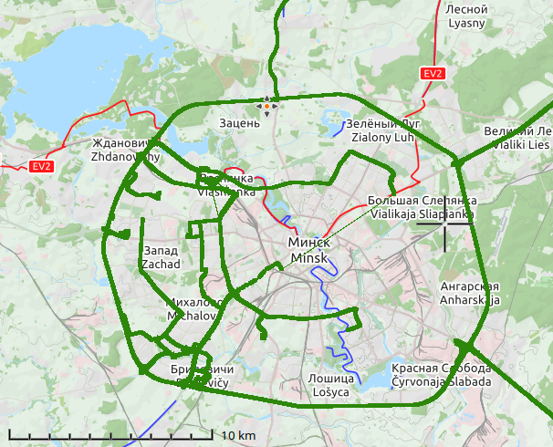

# GPSFire

**Open-source GPS logger on ESP32 and M5Stack platform**

**Hardware components**

- [ATOM GPS Development Kit](https://m5stack.com/collections/m5-atom/products/atom-gps-kit-m8030-kt)
or
- [M5Stack FIRE](https://m5stack.com/collections/m5-core/products/fire-iot-development-kit)
or
- [Arduino ESP32 compatible](https://en.wikipedia.org/wiki/ESP32)

DIY GPS tracker based on M5Stack platform with open source code.
The tracker is meant to be placed in a car and has the following features:
- Track GPS coordinates;
- Save GPX track file on a SD card;
- Work as Wi-Fi point with simple HTTP server for GPX files hosting.

ToDo:
- Save KLM track file on a SD card;
- Upload track files to a private cloud.

**Track example**

***If you have any questions, please do not hesitate to contact me.***

[allavrinenko@gmail.com](mailto:allavrinenko@gmail.com)

Alexandr.
